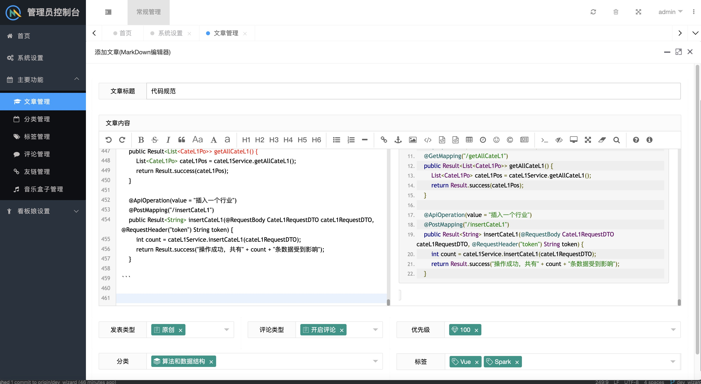

<p align="center">
	<strong>blogex是一个基于单体应用的前后端分离个人博客系统</strong>
</p>
<p align="center">
<a target="_blank" href="https://gitee.com/guangxikejidaxue/blogex-plus/blob/master/LICENSE">
    </img>
</a>
<a target="_blank" href="https://gitee.com/guangxikejidaxue/blogex-plus">
        </img>
        </img>
        </img>
        </img>
        </img>
        </img>
        </img></a>
</p>

----
# 前言
1. 本项目是一个经历了互联网大裁员的菜鸡21届应届生在离职期间所做。如大家所见，blogex-plus只是一个简单的项目，没有什么高并发，大数据量，仅仅只是个人喜好定制。
2. 在我的认知，服务器很贵，没必须要写得特别高级让我的服务器连部署都部署不上，抛开实际业务谈架构就是耍流氓，所以也就有了单体应用版本，需要分布式模块请到别的分支。
3. 由于我是个后端偏点大数据的开发，前端就是个菜鸡，所以前端只能使用vue.js(非工程化)，Layui(样式，虽然Layui官网已经关闭了)，jquery(没错，就是那个已经过时的jquery)。 前端主页面借鉴Java开源项目Solo的nijigen样式，其他样式基于Layui修修补补。
4. 在代码层面上，对于后端的代码你会发现非常整洁的代码，这是我的习惯，我不喜欢别人把代码写烂，当然我的规范不一定是对的，欢迎大家点评指导。
5. 本人文采不好，也不想包装项目，不想跟风那些被培训机构污染的互联网风气，所以不喜勿喷。如果大家喜欢这个项目，多多star，谢谢各位。
6. kubernetes部署方式目前还未测通.....
----

# 演示地址
http://spzgczyj.top/blog/index.html

----
# 功能简介

- **多种文件存储**：七牛云、本地存储。
- **响应式**：前端页面基于响应式设计，兼容移动端和PC端。
- **自定义音乐栏位**：支持自定义自己的播放歌单、上传音乐文件等。
- **自定义看板娘**：支持摆放自己的自定义的看板娘，兼容v1和v3版本的moc。
- **备份看板娘**：用户可以点击备份看板娘按钮下载压缩后的全部看板娘文件。
- **图片验证**：支持两种图片验证，干扰线图片验证及滑块验证(均非第三方插件)。
- **评论**：显示评论者的ip地址、浏览器标识和评论者操作系统信息，邮件通知评论回复。
- **优先级**：文章和音乐栏支持设置优先级，可以让你把你认为最有价值的文章或者音乐摆在最前面。
- **多种编辑器**：MarkDown编辑器(editor.md)和富文本编辑器(TinyMCE)两种文章编辑器，可以自行选择。
- **向导**：在新增看板娘页面内，在不会操作的时候可以点击下方的问号，会有一段向导动画为您讲述操作流程。
- **备份sql**：可以在管理页面备份sql，对应的sql文件会被加密后发送到博主的邮件内，对应的解压密码由图片验证码的方式展示在管理平台上。

----

# 模块划分

| 模块  | 功能描述 | 备注 |
| :------------: | :------------: | :------------: |
| blogex-api | 核心业务类模块，提供博客的主要功能 | 文章、标签、评论、分类等 |
| blogex-common | 各模块公用的依赖包 ||
| blogex-dao | 数据库访问层 | |
| blogex-ui | 前端 | 原生的html |

----
# 部分截图（界面均为响应式）

#### 1.主界面


#### 2.文章详情页


#### 3.评论区


#### 4. 管理员后台（使用管理员后台或者管理员后台所用的增删查改接口都需要管理员权限才能操作）


#### 5. 自定义博主信息（你可以在后台修改博主的信息，你的qq号将作为博主的头像，博主名可在管理员后台任意修改）


#### 6.文章管理


#### 7.MarkDown编辑器


#### 8.富文本编辑器


#### 9.音乐盒子管理


####  10.看板娘管理


####  11.向导


####  12.图片阅览


----
#### 使用说明

1. 程序以学习为目的，请不要作其他的用途。
2. 数据库编码：字符集：utf8mb4 -- UTF-8 Unicode（一定得是utf8mb4，不然存不了表情，mysql5.5.3后才增加utf8mb4编码），创建数据库blogex，导入sql文件夹下的blogex.sql
3. 配置文件修改，修改env/dev.properties，修改数据库账号密码和redis配置根据个人需求修改对应的配置文件
   如果需要开启七牛云存储的配置，请配置以下参数：
   ```properties
   qiniu.enable=true
   qiniu.accessKey=yourAccessKey
   qiniu.secretKey=yourSecretKey
   qiniu.bucket=yourBucket
   qiniu.domain-of-bucket=http://xxxx.xxxx.xxxx
   ```
   如果需要开启邮件服务，请在管理员控制台的系统配置开启邮件服务，并且配置以下参数：
   ```properties
   spring.mail.username=xxxxxx@163.com
   spring.mail.password=xxxxxxx
   spring.mail.host=smtp.163.com
   spring.mail.port=465
   blogex.mail.send.admin=true
   blogex.mail.visitor.reply=false
   ```
   blogex.mail.send.admin指收到回复的时候是否发送给管理员邮件，blogex.mail.visitor.reply指游客之前评论是否发送邮件通知对方，这两个值都可以不配置，默认是false
4. 配置完env/dev.properties后，启动mysql，redis，再将blogex-api启动
5. 配置blogex-ui/js/main.js内的apiBaseUrl，可以根据自身后端的部署情况选择配置
6. 访问http://localhost:20010/uploads/blogex-ui/adminLogin.html
7. 登录管理系统，配置系统参数和博主信息，默认账号是admin，密码是123456，登录系统后点击这里修改账号和密码，修改的过程需要验证图片验证码


修改账号和密码，登录的过程用到了非对称加密，理论上是安全的，如果有不足之处希望各位帮忙指出。 目前暂不支持修改用户名，如果需要修改用户名，请手动修改t_users表及t_roles的数据
8. 系统配置

系统设置中接口域名(后端接口地址域名)这个参数用于文件存储模块本地文件上传的时候拼接路径前缀，如图后端服务接口的前缀是http://localhost:20010/，博客的域名(前端域名)同样重要，在发送邮件的时候， 博客域名用于拼接文章详情页的url，如图，前端域名是http://localhost:20010/uploads/blogex-ui，根据个人网站域名配置即可。 
11. 图片上传和音乐上传可以走其他文件存储方式，但是live2d目前只能走本地文件存储方式，当然上传live2d到七牛云或者阿里云oss，然后填写live2d的url也可。
----
